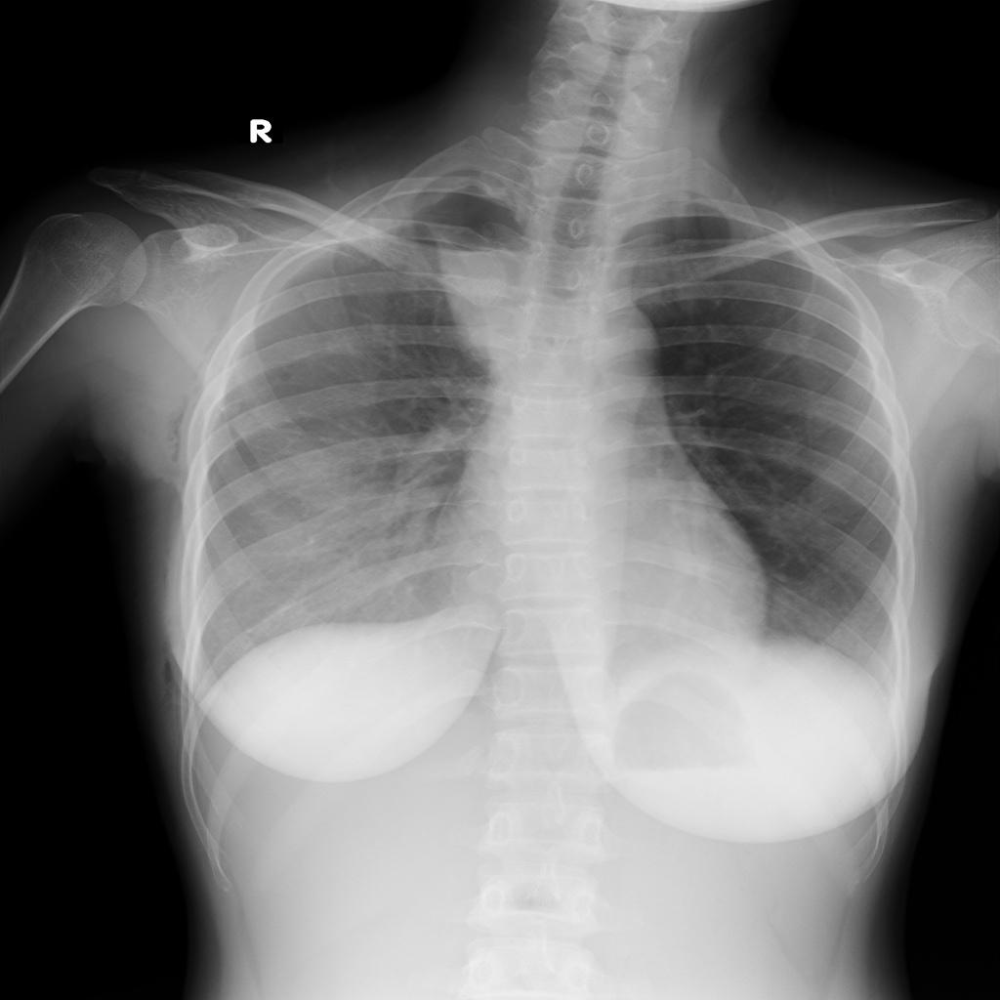
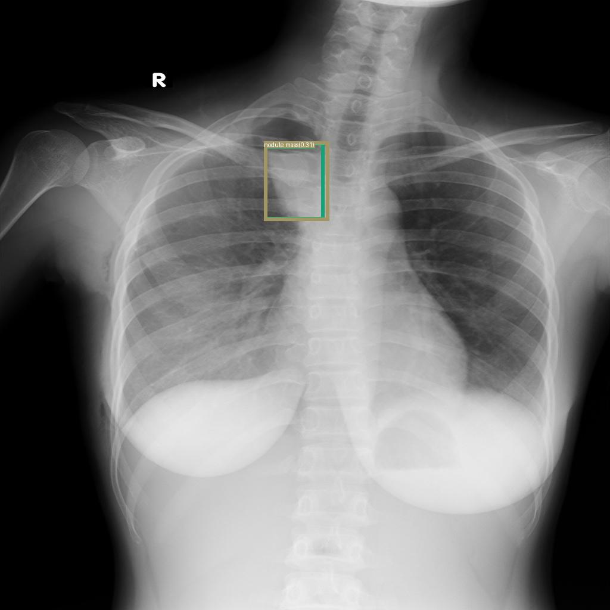
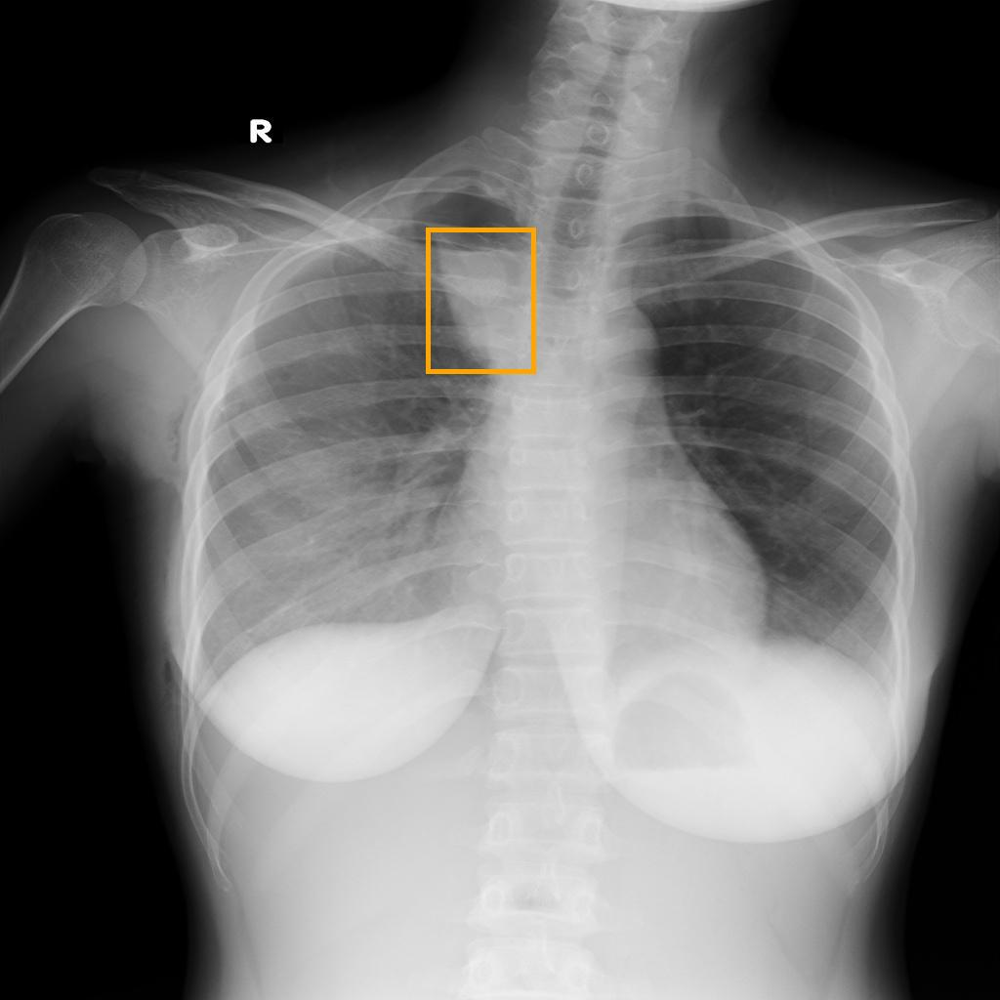

<div align="center">
  
</div>


### This is a specialized implementation of the paper **[Grounding DINO: Marrying DINO with Grounded Pre-Training for Open-Set Object Detection](https://arxiv.org/abs/2303.05499)** by [Zuwei Long]() and [Wei Li](https://github.com/bigballon).

This project fine-tunes GroundingDINO using Open-GroundingDino on a filtered version of the VinBigData Chest X-ray dataset, which contains approximately 5,000 images and 14 distinct medical imaging classes. The implementation includes tailored modifications for processing COCO and odvg data formats in the context of medical imaging.

If you need additional details or clarification, visit the [Open-GroundingDino repository](https://github.com/longzw1997/Open-GroundingDino).

# Dataset Overview

The dataset includes 14 classes of abnormalities:

0: aortic enlargement

1: atelectasis

2: calcification

3: cardiomegaly

4: consolidation

5: ild (interstitial lung disease)

6: infiltration

7: lung opacity

8: nodule mass

9: pleural effusion

10: pleural thickening

11: pneumothorax

12: pulmonary fibrosis

13: other lesion

# Features

|                                   | Official release version | The version we replicated |
| --------------------------------- | :----------------------: | :-----------------------: |
| Inference                         |         &#10004;         |         &#10004;          |
| Train (Object Detection data)     |         &#10006;         |         &#10004;          |
| Train (Grounding data)            |         &#10006;         |         &#10004;          |
| Medical Dataset Integration       |         &#10006;         |         &#10004;          |
| Custom Class Labels for Detection |         &#10006;         |         &#10004;          |


# Setup

I used Python 3.10.12, PyTorch 2.5.1+cu121, and CUDA 12.2, but other compatible versions may work.

**1. Clone the repositories.**

- Clone the Open-GroundingDino repository:

    ```bash
    git clone https://github.com/longzw1997/Open-GroundingDino.git && cd Open-GroundingDino/
    ```

- Clone the GroundingDINO repository

    ```bash
    git clone https://github.com/IDEA-Research/GroundingDINO.git
    ```

**2. Install the required dependencies.**

- Open-GroundingDino:

    ```bash
    pip install -r requirements.txt 
    cd models/GroundingDINO/ops
    python setup.py build install
    python test.py
    cd ../../..
    ```

- GroundingDINO:

    ```bash
    cd GroundingDINO
    pip install ninja
    pip install -e . --no-build-isolation --verbose
    cd ..
    ```

**3. Jupyter Notebook for Training:**

- Use the `tiny_model.ipynb` file to set up and train on your own dataset. This notebook provides detailed steps for:

    - Preparing the dataset
    - Configuring files for training and inference
    - Running training and generating predictions

- To open the notebook:

    ```bash
    jupyter notebook tiny_model.ipynb
    ```

**4. Download required models:**

- Pre-trained model checkpoint:

    ```bash
    wget https://github.com/IDEA-Research/GroundingDINO/releases/download/v0.1.0-alpha/groundingdino_swint_ogc.pth
    ```

- Pre-trained BERT model: Run the provided code in `tiny_model.ipynb` to download and save the BERT tokenizer and model locally.

**5. Verify environment:** Ensure the installation was successful by checking Python and PyTorch versions:

```bash
python3 --version
python -c "import torch; print('PyTorch version:', torch.__version__); print('CUDA available:', torch.cuda.is_available())"
```

# Dataset

### VinBigData Chest X-ray Dataset 

The dataset is filtered down to ~5,000 images in COCO format for validation and converted to odvg format for training. See the modifications in `tools/coco2odvg.py` for medical imaging class mappings.

#### Class Mappings:

```json
{
    "0": "aortic enlargement",
    "1": "atelectasis",
    "2": "calcification",
    "3": "cardiomegaly",
    "4": "consolidation",
    "5": "ild",
    "6": "infiltration",
    "7": "lung opacity",
    "8": "nodule mass",
    "9": "pleural effusion",
    "10": "pleural thickening",
    "11": "pneumothorax",
    "12": "pulmonary fibrosis",
    "13": "other lesion"
}
```

**Dataset Preparation Steps:**

1. Download the dataset from VinBigData and extract it.
2. Convert training data to odvg format using `tools/coco2odvg.py.`
3. Keep validation data in COCO format.


# Config

Updated configurations:

- `cfg_odvg.py`: Handles model-specific parameters like backbone, batch size, and learning rate.
- `datasets_mixed_odvg.json`: Specifies paths for training and validation data.

Label mappings are embedded directly:

```python
label_list = [
    "aortic enlargement", "atelectasis", "calcification", "cardiomegaly",
    "consolidation", "ild", "infiltration", "lung opacity", "nodule mass",
    "pleural effusion", "pleural thickening", "pneumothorax", "pulmonary fibrosis", "other lesion"
]
```

# Training

Modify `train_dist.sh` for single GPU training. Example:

```bash
CFG="~/content/Open-GroundingDino/config/cfg_odvg.py"
DATASETS="~/content/Open-GroundingDino/config/datasets_mixed_odvg.json"
OUTPUT_DIR="~/content/output_tiny"

bash train_dist.sh $CFG $DATASETS $OUTPUT_DIR
```

# Inference

Run inference on the validation set or individual images with text prompts representing the classes. Modified `inference_on_a_image.py` saves predictions in both image and JSON formats.

Example for a single image:

```bash
python tools/inference_on_a_image.py \
    -c tools/GroundingDINO_SwinT_OGC.py \
    -p ~/content/output_tiny/checkpointX.pth \
    -i ~/content/xray_data/xray_data/valid/sample.jpg \
    -t "nodule . pleural effusion . pneumothorax" \
    -o ~/content/inference_output
```

# Results


| Prompt |          Raw Image        |        Predicted         |        Ground Truth      |
| :----: | :-----------------------: | :----------------------: | :----------------------: |
| nodule |  |      |  |


# Acknowledgments

Provided codes were adapted from:

- [microsoft/GLIP](https://github.com/microsoft/GLIP)
- [IDEA-Research/DINO](https://github.com/IDEA-Research/DINO/)
- [IDEA-Research/GroundingDINO](https://github.com/IDEA-Research/GroundingDINO)
- [Open-GroundingDino](https://github.com/longzw1997/Open-GroundingDino)


# Citation

```
@misc{Open_GroundingDino_Medical,
  author = {Kyle Musgrove},
  title = {Open Grounding DINO for Medical Imaging},
  howpublished = {\url{https://github.com/CuriousNeuralNerd/GroundingDINO-Med}},
  year = {2024}
}
```